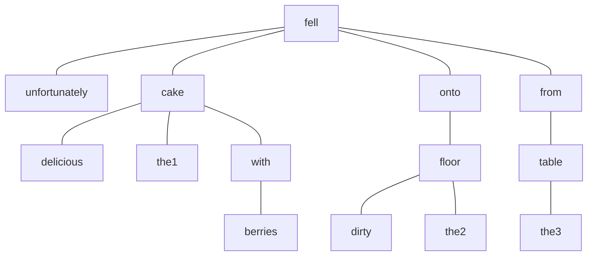

[The delicious cake with berries] [unfortunately fell] [onto the dirty floor] [from the table].

(fell unfortunately (cake delicious the (with berries)) (onto (floor dirty the)) (from (table the)))

