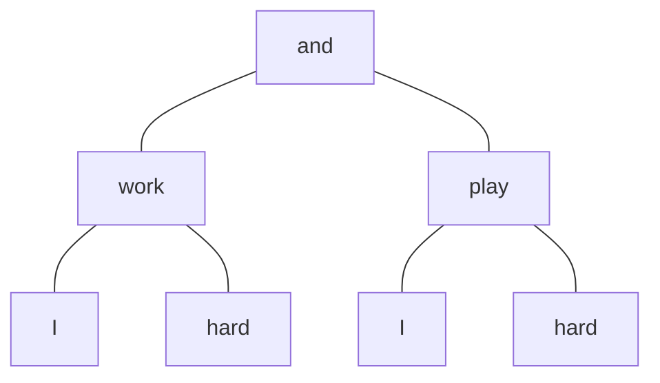

notation:
- `A` >> `B`, `B` << `A` (conjunctions): the conjunction `A` has higher precedence than `B`
- `if1`, `and2`, `you4`, etc.: when a word appears more than once we name them by appending a number, starting at 1 in the order of appearance.
- 3-7 (clauses / phrases): if a sentence is broken down into clauses or phrases, a refernce in the form `M-N` (M to N) means the verbatim chunk of the sentence starting at clause M and ending at N. e.g., in *if A then B otherwise C* `A-C` would not include the `if`


## Ex1: I work hard and I play hard.

```lisp
(and :: conj
    (work :: verb
        I :: noun
        hard :: adj
        )
    (play :: verb
        I :: noun
        hard :: adj)
)
```



## Ex2: Farting or belching is mildly impolite.
```lisp
(is :: verb
    (or :: conj
        Farting :: ~noun - gerund~ no, adjective? - participle
        belching :: ~noun~ adj/participle
    )
    (impolite :: noun? no, adjective
        mildly :: adverb | -ly -> (adjective -> verbal adverb? )
    )
)
```

> to re-cover again: adjectives appling to adjectives

> note: `fart` is a noun. so as a verbal it doens't make sense to be an adjective. <br>
> sounds like a good trick for remembering

## Ex3: I went to a fancy university, yet I’m still quite ignorant.
```lisp
(yet :: conj
    (went :: verb
        (to university :: infinitive version of university :: noun
            a :: mod (adj? determinate)
            fancy :: adj
        )
    )
    (am I (ignorant::adj still::adv quite::adv)))

    -- wrong, initial answer below
    (am :: verb (tricky one)
        (I :: noun -- does still go here?
            still :: adj
        )
        (ignorant :: adj
            quite :: adverb
        )
    )
)
```


## Ex4: I write because I like good ideas.
```lisp
(because :: conj
    (write :: verb 
        I :: noun)
    (like :: verb
        I
        (ideas :: noun
            good :: adj))
)
```


## Ex5: The bully hit my buddy and me pretty hard.
```lisp
(hit :: verb
    (bully the)
    (and (buddy my) me)
    (hard pretty))
```


## Ex6: I seriously think that Ayn Rand was wise.
```lisp
-- what is that? can be tonnes
-- conjunction, what's the significance?
(that :: conj
    (think :: v
        I :: noun
        seriously :: ~adj~ no, ~verbal,~ cant be.
        *adverb*. eddy that's my final answer.)
    (was :: v
        Ayn Rand :: n
        wise :: n)
(think
    I :: noun
    seriously :: adj
    (was
        Ayn Rand :: n
        wise :: n)
```

that -- what is that? can be tonnes
* I can't tell the difference between the sentences (with and without)
* complementizer? https://english.stackexchange.com/questions/177128/necessity-of-that-as-a-conjunction
* introduces *tensed clause* -- so the whole clause is ni the past, not the state of rand being wise i.e. she'd still be wise if she were alive.
* using emphasis trick (emphasising *was* in each option) doesn't make it clearer :/
* heh from xmasthat.html: "I'll attempt, though, to set out a succinct set of guidelines, but you needn't implant them. Implants are notorious for falling out when you need them."

moving on


## Ex7: Don’t chew quickly while your mouth is open.
```lisp
(while :: conj,subordinating 
    (do :: v
        (chew :: v
            quickly :: adverb,participle) (?)
        not :: adverb
    )
    (is :: v
        (mouth :: n
            your :: mod,pronoun)
        open :: n
        )
    )
```


## Ex8: My daughter likes big dogs, but my son likes adorable cats.
```lisp
(but :: conj,coordidnating
    (likes
        (daughter my)
        (dogs big))
    (likes
        (son my)
        (cats adorable))
)
```


## Ex9: If universities are full of uncurious professors, don’t attend one.
```lisp
(if :: conj
    (do :: verb
        (attend :: v -- is 'do' or attend as root of verbphrase?
        -- attend - aux/helper verb
            one :: noun)
        not :: mod
    )
    (are :: v
        universities :: noun
        (full :: adj
            (of
                (professors :: noun
                    uncurious :: adj
        )))
    )
)
```


    only here for convenience: (proper version at top)
    notation:
    - `A` >> `B` | `B` << `A` (conjunctions): the conjunction `A` has higher precedence than `B`

## Ex10: After you throw a small, red ball, while you sing, you should stamp your feet loudly, and you should clap your hands energetically, if it’s still daytime.

```lisp
(after :: conj.subordinating
    (while :: conj.subordinating
        (throw :: v
            you :: n
            (ball :: n
                a :: adj,determiner
                small :: adj
                red :: adj))
        (sing::v you::n)
    )
    (if :: conj,subordinating
        (is :: v
            it :: n
            still :: adverb  -- putting adverb here
                             -- makes compilation easier
            daytime :: noun)
        (and :: conj,coordinating
            (should :: v
                you :: n,pronoun
                (stamp :: v
                    your :: adj,det
                    feet :: n
                    loudly :: adverb
                ))
            (should :: v
                (clap :: v
                    your :: adj,det
                    hands :: n
                    energetically :: adv
                    ))
            )
    )
)
```

After you throw a small, red ball, while you sing, you should stamp your feet loudly, and you should clap your hands energetically, if it’s still daytime.

clauses:

1. you throw a small, red ball,
2. you sing,
3. you should stamp your feet loudly,
4. you should clap your hands energetically,
5. it’s still daytime.

in this sentence `if` >> `and`. consider *3, and 4, if 5*: The comma before `if` makes it more specific: ((3 and 4) if 5).

consider *3, and 4 if 5*, then (3 and (4 if 5)), thus `if` << `and` in this case, and not in the prior case.

> Note: I'm really not sure about this anymore, it's a deep rabbit hole.
